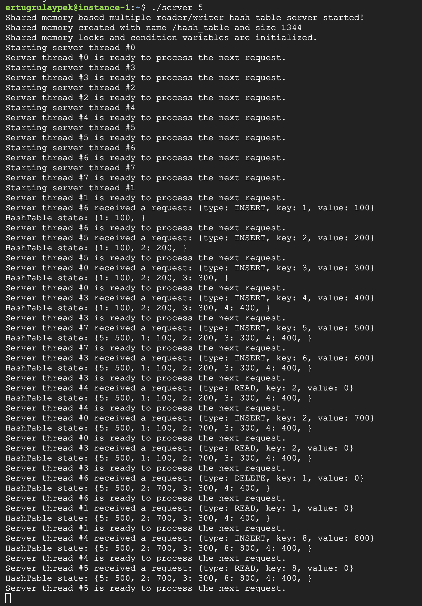
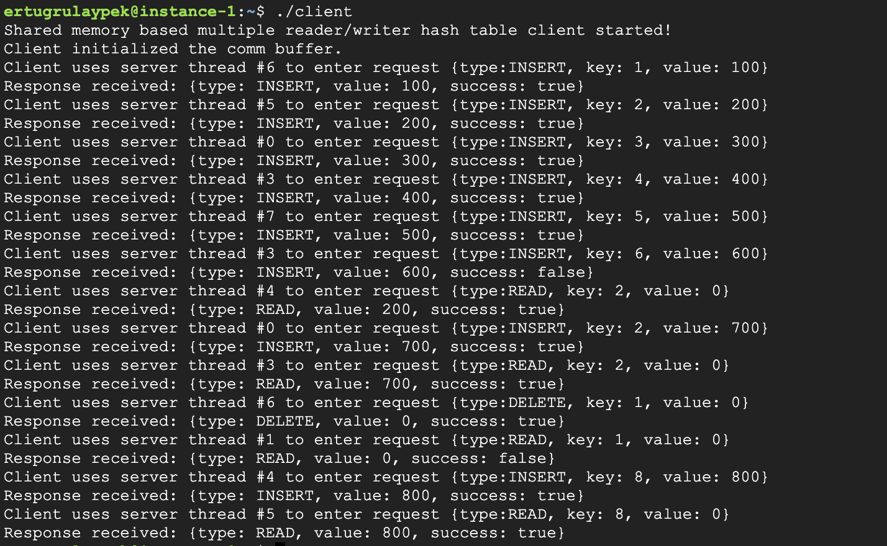

# Shared memory based multi client-server hash table

**Keywords**: *C++, POSIX, shmem, mutex, condition variable, reader-writer lock, pthread, client-server, hash table*

This is a C++ project consisting of a client and a server program where the client interacts with the hash table in server via requests written in shared memory. 

## Server program

The server program stores the custom implemented hash table in memory and updates it based on the clients' requests. Client-server communication is based on POSIX shared memory system. The server operates on 8 threads where each thread handles one client request at a time. To synchronize the request reads/writes, the shared memory contains 8 blocks. Each thread reads from or writes to one of these blocks. Each of these blocks contain two condition variables (one for request and one for response events) and a mutex. These are used to ensure that no other client can access the shared memory until a request is served and consumed by the requester. 

## Client program

The client program initiates access to the shared memory and enters its requests one by one to different memory segments. A request's target memory segment is randomly selected to balance the server threads' load from the client side. 

Note: Existing set of client requests can be changed in client.cpp's main() function.

## Hash table implementation

The hash table is one of the simplest implementations. It has a fixed capacity and it rejects any insertions after it becomes full. The hash code is calculated based on **key % capacity** formula.

Since multiple server threads are operating on the same hash table, it needs to be synchronized. For that purpose, *pthread_rwlock_t* by POSIX is used. For insertion and deletion operations, writer lock is acquired. And for read operation, reader lock is acquired. This allows multiple readers to access the table concurrently but only one writer to access at a time.

## How to run

This project is tested on a Debian GNU/Linux 11 (bullseye) machine using g++ (Debian 10.2.1-6) 10.2.1 20210110. 

To compile and run the project, please follow below instructions in project root:

1- Open two terminals.

2- On terminal #1, execute: **make**. This will create two executables, namely **server** and **client**.

3- On terminal #1, execute: **./server 5** where 5 represents the hash table size and it can be any positive integer.

4- On terminal #2, execute: **./client**

**Note**: One can have any number of client program instances at the same time. The synchronization blocks in the shared memory is tuned to be process shared. 

## Example client server run

